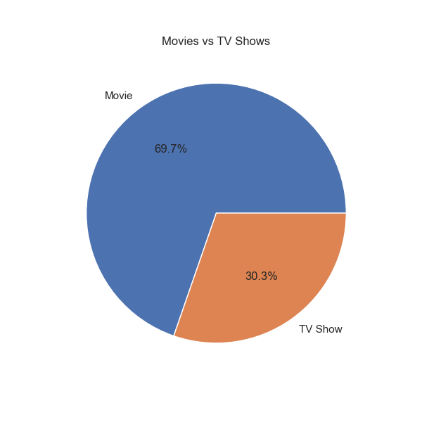
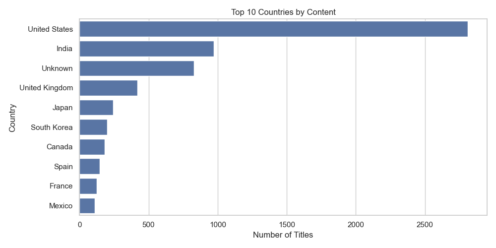
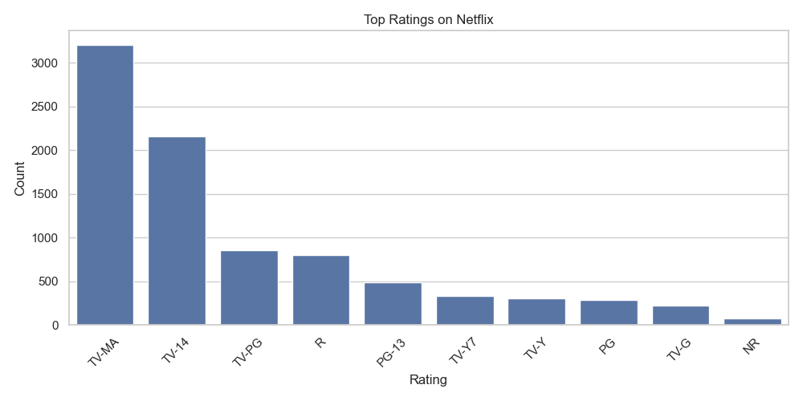
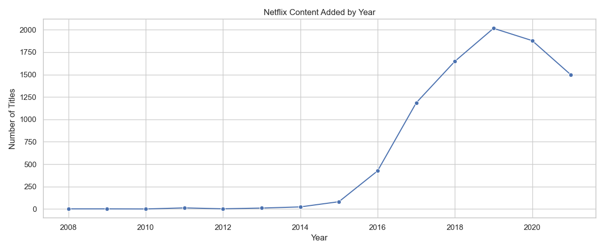
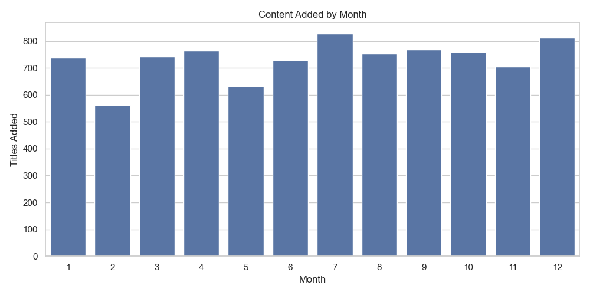
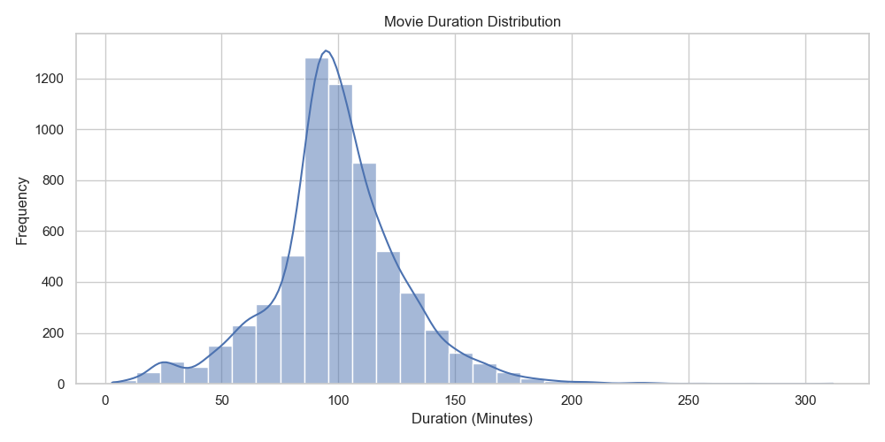
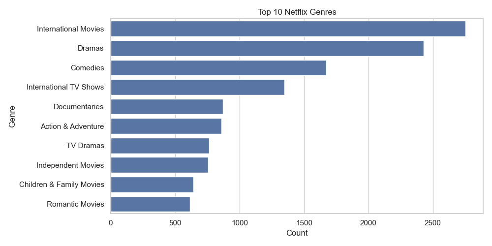

# Netflix Content Visualization & Analysis

## Project Overview

This project performs Exploratory Data Analysis (EDA) on the Netflix Titles Dataset using Python. The goal is to analyze Netflix content trends, ratings, genres, countries, and growth over time through data cleaning and visualization techniques.

## Dataset

* Source: Netflix Titles Dataset
* Total Records: 8,807
* Cleaned Records: 8,790
* Features: 15 columns after cleaning

## Tools & Technologies

* Python
* Pandas
* NumPy
* Matplotlib
* Seaborn

## Project Workflow

### Week 1 – Data Understanding

* Loaded dataset
* Inspected structure and data types
* Identified missing values
* Generated summary statistics

### Week 2 – Data Cleaning

* Handled missing values
* Converted date columns
* Extracted year and month information
* Cleaned duration column
* Created cleaned dataset

### Week 3 – Data Visualization

* Movies vs TV Shows distribution
* Top producing countries
* Ratings analysis
* Content growth by year
* Monthly content additions
* Movie duration distribution
* Genre analysis

## Key Insights

* Movies represent approximately 70% of Netflix content.
* The United States is the largest content producer.
* India is the second-largest contributor.
* TV-MA is the most common content rating.
* Netflix experienced rapid content growth between 2016 and 2019.
* International Movies and Dramas are among the most popular genres.

## Visualizations

### Movies vs TV Shows



### Top Countries



### Ratings Distribution



### Content Added by Year



### Content Added by Month



### Movie Duration Distribution



### Top Genres



## Repository Structure

```text
Netflix-Content-Visualization/
│
├── netflix_titles.csv
├── netflix_titles_cleaned.csv
├── EDA_code.py
├── data_cleaning.py
├── visualization.py
├── images/
└── README.md
```

## Author

Dhanushri Muthukumaran
B.Tech Artificial Intelligence and Data Science
